# 🐾 Animal Classification Project

## 📌 Project Overview

This project classifies **15 animal species** based on images using deep learning. Due to the limited dataset size (~1900 images), **data augmentation** and **transfer learning** were employed. The final model is able to identify animals like **Dog, Cat, Tiger, Lion, etc.** from images.

---

## 🎯 Objective

Build a robust image classification system that can identify **15 animal classes** from images:

```python 
['Bear', 'Bird', 'Cat', 'Cow', 'Deer', 'Dog', 'Dolphin', 'Elephant', 'Giraffe', 'Horse', 'Kangaroo', 'Lion', 'Panda', 'Tiger', 'Zebra']
```
---

## 📊 Dataset Summary

- **Total images**: ~1900  
- **Classes**: 15 (animals)  
- **Image size**: 224 × 224  
- **Structure**: 15 folders (one per class)

---

## 🧹 Data Augmentation

To improve generalization, the following augmentations were applied:

```python
ImageDataGenerator(
    rotation_range=20,
    width_shift_range=0.2,
    height_shift_range=0.2,
    shear_range=0.2,
    zoom_range=0.2,
    horizontal_flip=True,
    brightness_range=[0.9, 1.1],
    channel_shift_range=10.0,
    fill_mode='nearest',
)
```
# Image Augmentation Examples

Here are 7 Important augmentations applied to the image:

<div style="display: grid; grid-template-columns: repeat(2, 1fr); gap: 20px;">

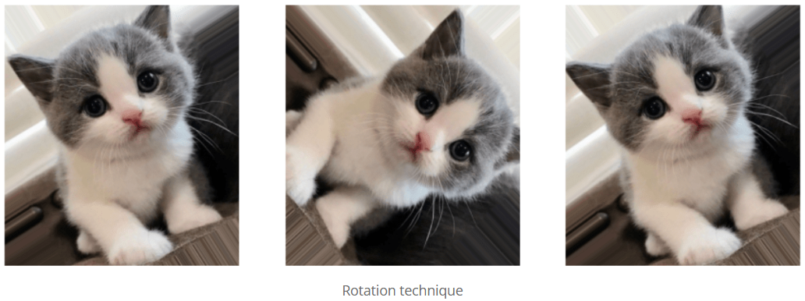

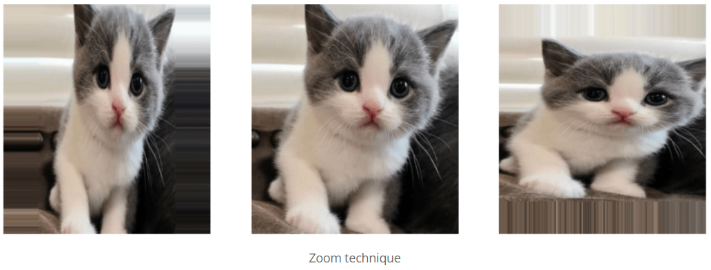

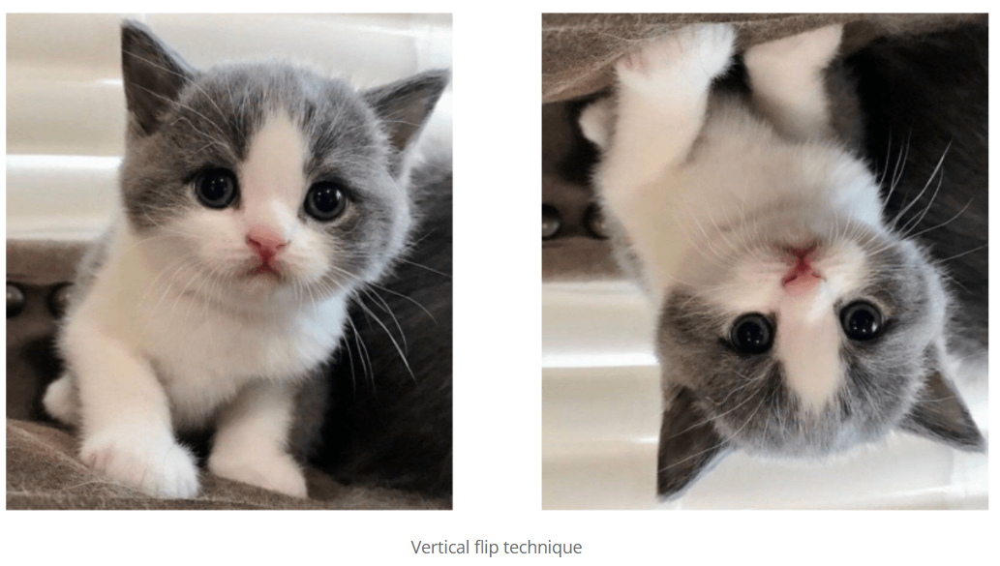

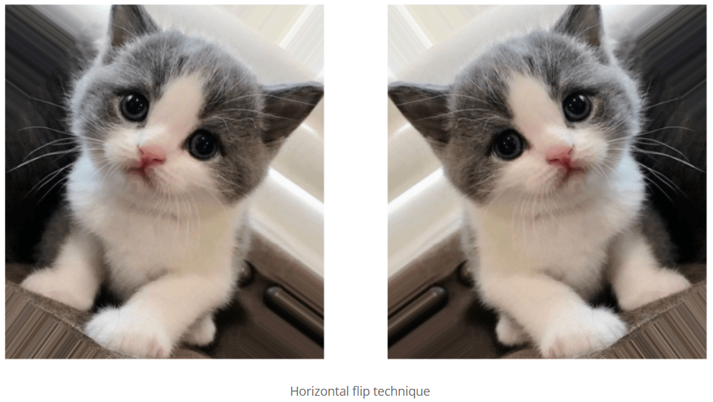

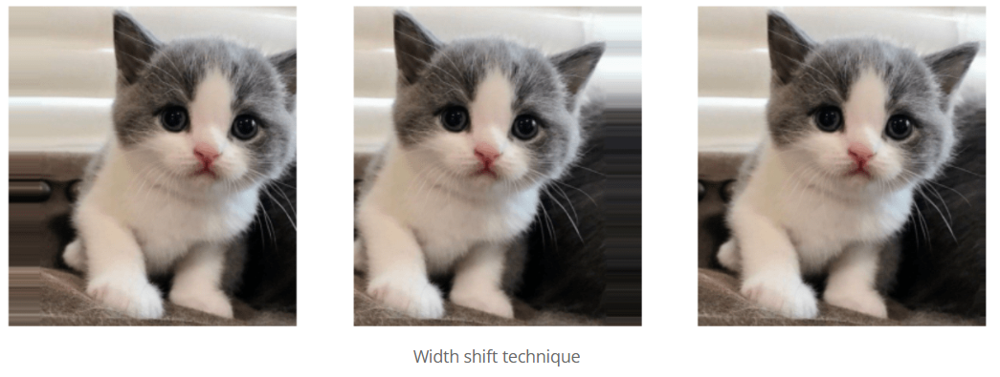

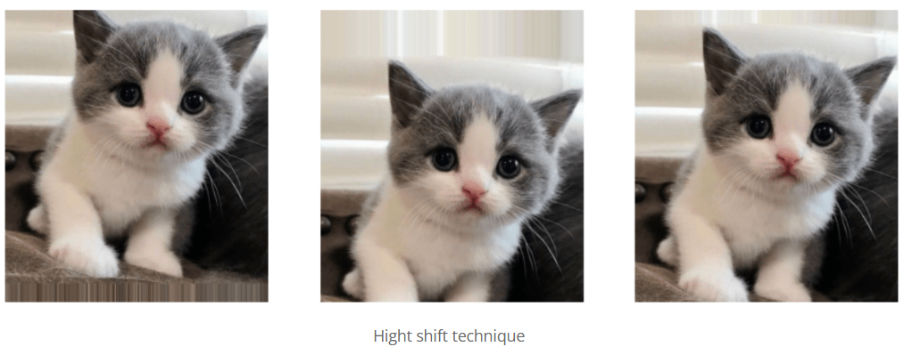

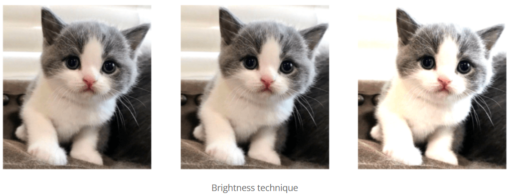

</div>


## 🧠 Model Comparisons

### 📉 Model 1: CNN From Scratch (Baseline)

Image input size = (224,224)


Tried on 30 epochs. The accuracy and loss plot obtained is shown below:


- Training Accuracy steadily increases, reaching over 60%, showing the model is learning.  Validation Accuracy improves initially (~50%) but then flattens, indicating overfitting.

- Training Loss consistently decreases – a good sign. Validation Loss, however, fluctuates heavily after epoch 10–15, showing the model struggles to generalize.

🧠 **Summary:**

- This is a classic case of overfitting. The model learns the training data well but fails to generalize on unseen data. Indicates that the CNN from scratch isn’t effective for given dataset size. Transfer Learning is better here.


📦 **Transfer Learning (TL)**  
Transfer Learning uses a pretrained model (like MobileNetV2) that has already learned rich features from millions of images (e.g., ImageNet).

### 📉 Model 2: Transfer Learning with MobileNetV2

MobileNetV2 Architecture:

- **Inverted Residuals** – Expands channels first (1×1 conv), then applies depthwise conv (3×3), and finally projects back (1×1 conv). Wider in the middle, unlike traditional bottlenecks.

- **Linear Bottlenecks** – Uses linear (instead of ReLU) in narrow layers to avoid losing information.

- **Depthwise Separable Convolutions** – Depthwise (per-channel) + pointwise (1×1) convs for efficiency.

- **Expansion-Projection** – First expands channels (e.g., 6×), processes spatially, then compresses back.


Applied for 20 epochs. The accuracy and loss plot obtained is shown below:

  

📈 Accuracy    

- Training Accuracy steadily improves from ~20% to ~90%, showing that the model is effectively learning from the training data.
- Validation Accuracy also increases sharply early on and then plateaus around 90%, staying close to training accuracy.
- This indicates no significant overfitting and suggests good generalization to unseen data.

📉 Loss

- Training Loss drops consistently from ~2.7 to below 0.2, which is a strong indicator of effective learning.

- Validation Loss also decreases smoothly and stays close to the training loss curve, with very minor fluctuations after epoch 15.

This suggests the model is not overfitting, and it generalizes well.


## 💾 Saved Model  

The final trained model was saved using:

```python
model.save('model.h5')
```

## Results of Testing Model on Random Images

Below are 15 random test images with their predicted labels:


|      | 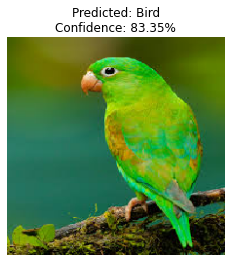     | 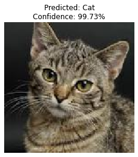      | 
| 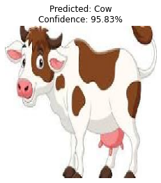      | 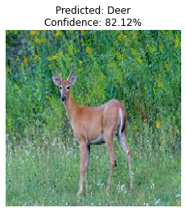     | 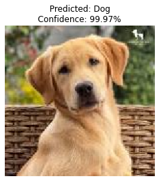      | 
| 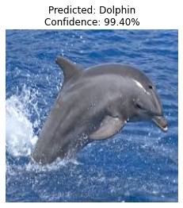  | 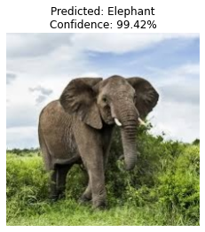 | 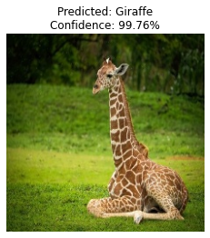  | 
| 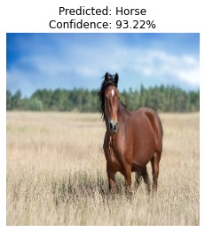    | 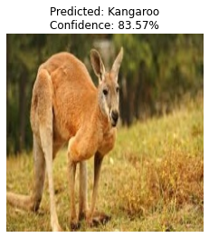 | 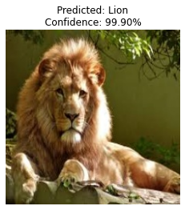     | 
| 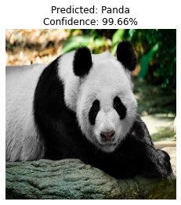    | 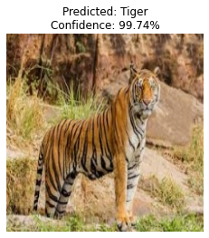    | 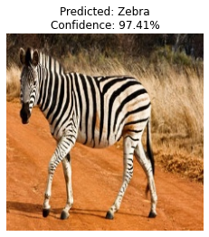    | 


## ⚠️ Misclassified Images and Analysis

Below are two examples where the model made incorrect predictions due to visual similarity:

| Misclassified Image | Predicted Label | Actual Label | Reason |
|------------------------|-----------------|--------------|--------|
| 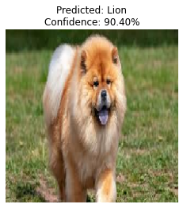 | Lion | Dog | The dog has a brown color and mane-like fur around its neck, resembling a lion. This visual similarity misled the model. |
| 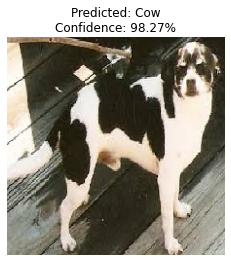  | Cow  | Dog | The dog's black and white spotted coat is similar to that of a cow, which likely confused the model. |


## 📉 Confusion Matrix

 

## 📋 Classification Report


