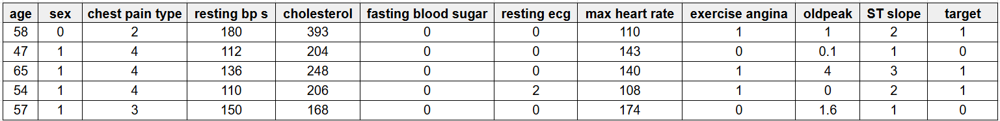
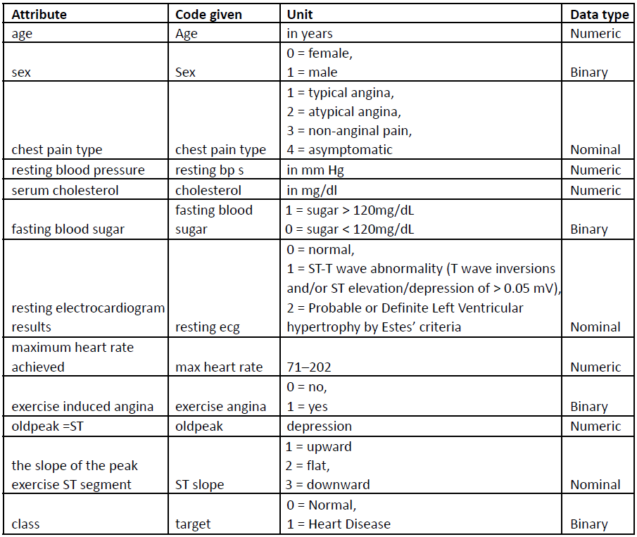
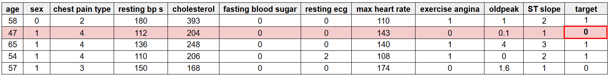
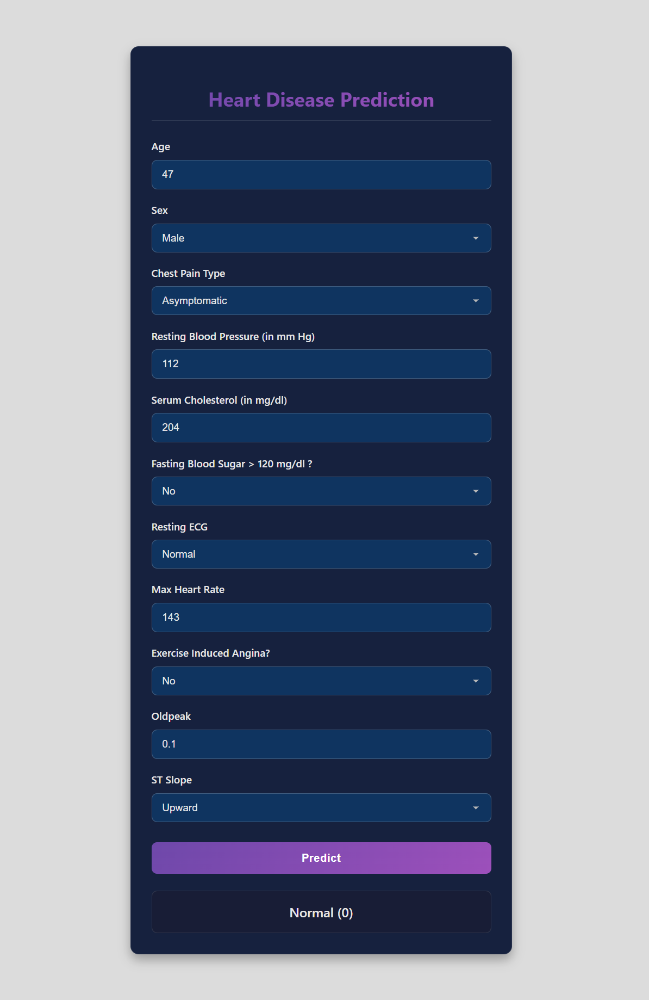
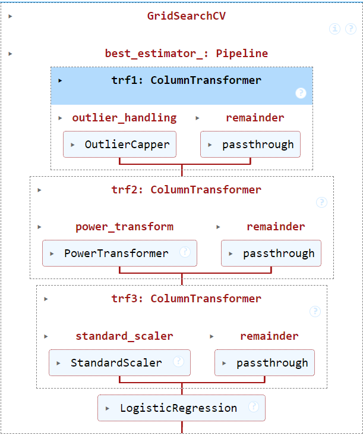

# Heart Disease Prediction using Logistic Regression

## Project Overview

This project aims to predict the likelihood of a person having heart disease using a Logistic Regression model. The model was trained on a dataset containing 1191 rows of health-related features. A user-friendly web interface allows individuals to input their data, which is then processed by the pre-trained model to provide an instant prediction.

## Features

* **Web-based User Interface**: An intuitive HTML form for inputting relevant health parameters.
* **Real-time Prediction**: Utilizes a pre-trained Logistic Regression model (`model.pkl`) to predict heart disease presence.
* **Data-driven Insights**: The model leverages a dataset of 1191 rows for robust training.


### Dataset
This is an sample dataset shown below.



The information about features is shown below.



### Web Application - Input Form
For testing we choose 2nd row data and filled it in the webpage form and when hit 'Predict' button then it will predict the result.

 

_The web interface where users can input their health parameters._


In above image we can see that, our model predicted that person do not have any heart disease.


## Technologies Used

* **Python**: Core programming language.
* **scikit-learn**: For machine learning model (Logistic Regression).
* **NumPy**: For numerical operations.
* **Pandas**: For data manipulation and analysis.
* **Matplotlib & Seaborn**: For data visualization (used during model training and exploration).
* **Flask**: For creating the web application (often used with `app.py` for web services).
* **HTML/CSS**: For the front-end web interface.

## Installation and Setup

To get this project up and running on your local machine, follow these steps:

1.  **Download the repo as a ZIP:**   
    (GitHub's "Code → Download ZIP" button). Extract the folder and navigate into it. 


2.  **Create a Virtual Environment (Recommended):**
    ```bash
    python -m venv venv
    source venv/bin/activate  # Linux/Mac
    venv\Scripts\activate     # Windows
    ```

3.  **Install Dependencies:**
    ```bash
    pip install -r requirements.txt
    ```

4.  **Run the Web Application:**
    ```bash
    python app.py
    ```

5.  **Access the Web Interface:**
    Open your web browser and navigate to `http://127.0.0.1:5000/` (or the address shown in your console).

## Project Structure

* `app.py`: The main Flask application file that handles web requests and model predictions.
* `model.pkl`: The pre-trained Logistic Regression model saved in a serialized format.
* `requirements.txt`: Lists all Python dependencies required for the project.
* `.gitignore`: Specifies files and directories that Git should ignore.
* `train_model.ipynb`: Jupyter Notebook containing the code for data exploration, model training, and evaluation.
* `dataset.csv`: The dataset used to train the machine learning model.
* `custom_transform.py`: Any custom data preprocessing or transformation functions used.
* `templates/`: Directory containing HTML template file.

## Data Analysis and Model Training

The [`train_model.ipynb`](./train_model.ipynb) notebook provides a comprehensive walkthrough of the data analysis and model training process.

### Exploratory Data Analysis (EDA)
The notebook includes various visualizations and statistical summaries to understand the dataset's characteristics, identify patterns, and prepare the data for modeling.

### Machine Learning Pipeline
A clear pipeline diagram illustrates the steps involved from raw data to the final model prediction, including data preprocessing, feature engineering, and model training.



_A visual representation of the machine learning pipeline._

🔁 trf1: ColumnTransformer – Outlier Handling
Step name: outlier_handling
Transformer: OutlierCapper – a custom transformer to cap or remove outliers.
remainder='passthrough': All other columns not explicitly transformed are passed through unchanged.

🔁 trf2: ColumnTransformer – Power Transformation
Step name: power_transform
Transformer: PowerTransformer – used to make data more Gaussian and stabilize variance.
remainder='passthrough': Non-transformed columns are passed through.

🔁 trf3: ColumnTransformer – Feature Scaling
Step name: standard_scaler
Transformer: StandardScaler – standardizes features by removing the mean and scaling to unit variance.
remainder='passthrough': Unscaled features are passed through as-is.

📈 Final Estimator – Model
Model used: LogisticRegression


## Model Details

A Logistic Regression model was chosen for its interpretability and effectiveness in binary classification tasks. The model was trained on the provided dataset to learn the patterns associated with the presence or absence of heart disease.


