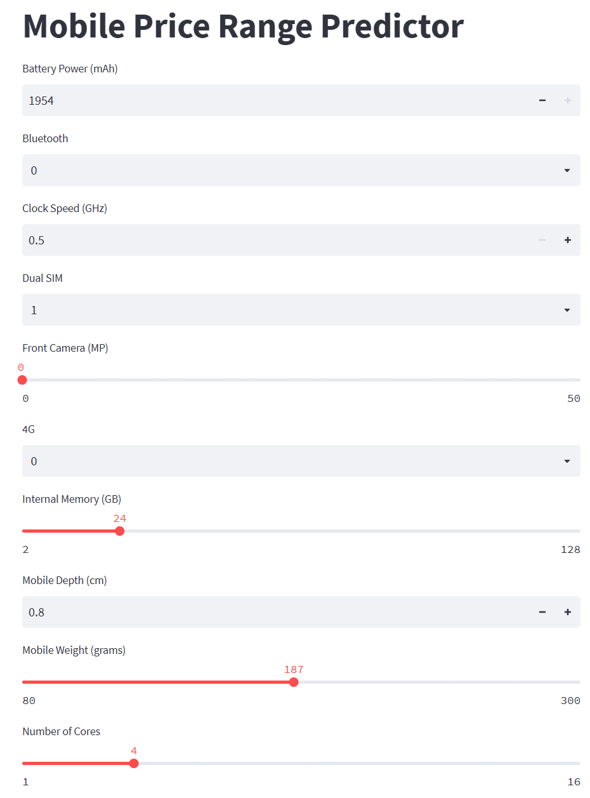
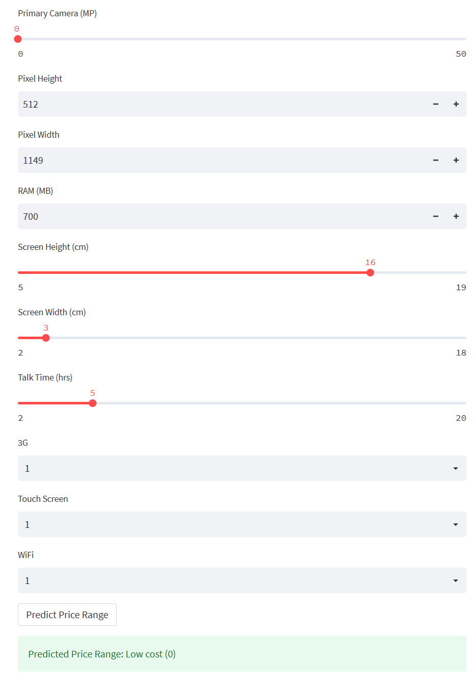
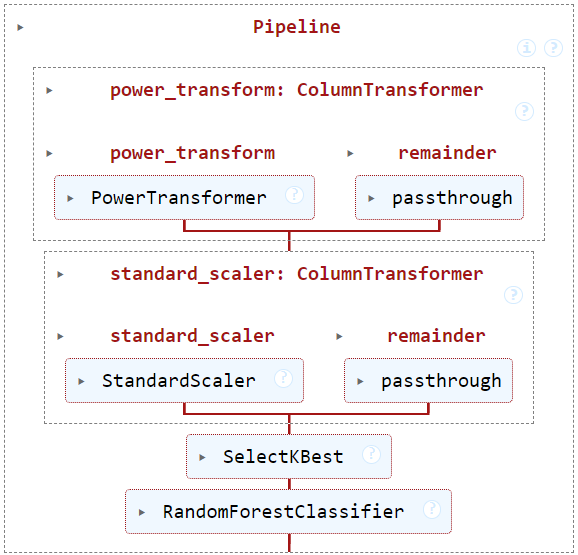

# 📱 Mobile Price Range Prediction using Machine Learning

## Project Overview

This project aims to predict the **price range of a mobile phone** using its specifications. The model classifies each phone into one of four price categories: **Low**, **Medium**, **High**, or **Very High**. The system leverages a supervised machine learning approach using classification algorithms trained on real-world mobile data.

A simple and intuitive web interface allows users to input phone specifications and instantly receive the predicted price category.

## 🎯 Objective

Build a machine learning model that accurately predicts the **price range** of a mobile phone based on its features.

Price Categories:
- **0**: Low Cost
- **1**: Medium Cost
- **2**: High Cost
- **3**: Very High Cost

---

## 📊 Dataset Description

The dataset includes various technical specifications of mobile phones and their corresponding price categories.

### Features

| Column         | Description |
|----------------|-------------|
| `battery_power` | Battery capacity (mAh) |
| `blue`          | Bluetooth support (1: Yes, 0: No) |
| `clock_speed`   | Processor speed (GHz) |
| `dual_sim`      | Dual SIM support (1: Yes, 0: No) |
| `fc`            | Front camera megapixels |
| `four_g`        | 4G support (1: Yes, 0: No) |
| `int_memory`    | Internal memory (GB) |
| `m_deep`        | Mobile depth (cm) |
| `mobile_wt`     | Weight (grams) |
| `n_cores`       | Number of processor cores |
| `pc`            | Primary camera megapixels |
| `px_height`     | Pixel resolution height |
| `px_width`      | Pixel resolution width |
| `ram`           | RAM (MB) |
| `sc_h`          | Screen height (cm) |
| `sc_w`          | Screen width (cm) |
| `talk_time`     | Battery life on a single charge (hrs) |
| `three_g`       | 3G support (1: Yes, 0: No) |
| `touch_screen`  | Touchscreen (1: Yes, 0: No) |
| `wifi`          | Wi-Fi support (1: Yes, 0: No) |


---

## 🌐 Web Application

Used Streamlit for user-interface where user can give input data and then model will predict the output.

<p align="center">
  
  

</p>

---

## ⚙️ Technologies Used

- **Python**: Core programming
- **Pandas, NumPy**: Data manipulation
- **Matplotlib, Seaborn**: Data visualization
- **scikit-learn**: Machine learning modeling
- **Streamlit**: Building interactive web applications for model deployment


---

## 🧪 Model Training and Evaluation

The model was trained using various classification algorithms. After testing, the best-performing model was chosen based on accuracy and F1-score. Key steps included:

1. **Exploratory Data Analysis (EDA)**
2. **Data Preprocessing**
   - Handling missing values (if any)
   - Power Transform on skewed data
   - Feature scaling
3. **Model Selection**
   - Random Forest
4. **Evaluation**
   - Accuracy, Precision, Recall, F1-Score, Confusion Matrix

---

## Installation and Setup

To get this project up and running on your local machine, follow these steps:

1.  **Download the repo as a ZIP:**   
    (GitHub's "Code → Download ZIP" button). Extract the folder and navigate into it. 


2.  **Create a Virtual Environment (Recommended):**
    ```bash
    python -m venv venv
    source venv/bin/activate  # Linux/Mac
    venv\Scripts\activate     # Windows
    ```

3.  **Install Dependencies:**
    ```bash
    pip install -r requirements.txt
    ```

4.  **Run the Application:**
    ```bash
    streamlit run app.py
    ```

5.  **Access the Web Interface:**
    You can now view your Streamlit app in your browser.  
    Local URL: http://localhost:8501  
    Network URL: http://192.168.246.98:8501  


## Project Structure

* `app.py`: The main streamlit application file that handles user interface  and model predictions.
* `model.pkl`: The pre-trained Random Forest model saved in a serialized format.
* `requirements.txt`: Lists all Python dependencies required for the project.
* `.gitignore`: Specifies files and directories that Git should ignore.
* `train_model.ipynb`: Jupyter Notebook containing the code for data exploration, model training, and evaluation.
* `dataset.csv`: The dataset used to train the machine learning model.


## Data Analysis and Model Training

The [`train_model.ipynb`](./train_model.ipynb) notebook provides a comprehensive walkthrough of the data analysis and model training process.

### Exploratory Data Analysis (EDA)
The notebook includes various visualizations and statistical summaries to understand the dataset's characteristics, identify patterns, and prepare the data for modeling.

### Machine Learning Pipeline
A clear pipeline diagram illustrates the steps involved from raw data to the final model prediction, including data preprocessing, feature engineering, and model training.



_A visual representation of the machine learning pipeline._

🔁 **trf1: ColumnTransformer – Power Transformation**  
Step name: power_transform  
Transformer: PowerTransformer(method='yeo-johnson') – Applies Yeo-Johnson power transformation to normalize right-skewed distributions.  
Features transformed:  
['pixel_density', 'screen_area', 'core_efficiency', 'fc']  
remainder='passthrough': All other columns remain unchanged.

🔁 **trf2: ColumnTransformer – Feature Scaling**  
Step name: standard_scaler  
Transformer: StandardScaler() – Standardizes features by removing mean and scaling to unit variance.  
Features scaled:   
['battery_power', 'fc', 'int_memory', 'm_dep', 'mobile_wt', 'pc', 'ram', 'talk_time', 'pixel_density', 'screen_area', 'core_efficiency']  
remainder='passthrough': Non-numerical features pass through without transformation.  

🔁 **trf3: Feature Selection**  
Step name: feature_selection  
Transformer: SelectKBest(score_func=f_classif, k=10) – Selects top 10 features using ANOVA F-value between features and target variable.  
Purpose: Improves model efficiency by keeping only most statistically significant features.

📈 **Final Estimator –**   
Model
Model used: RandomForestClassifier
Parameters: n_estimators=100, random_state=42  
Advantages:   
Handles non-linear relationships, provides feature importance, and generally performs well on classification tasks with multiple classes.


